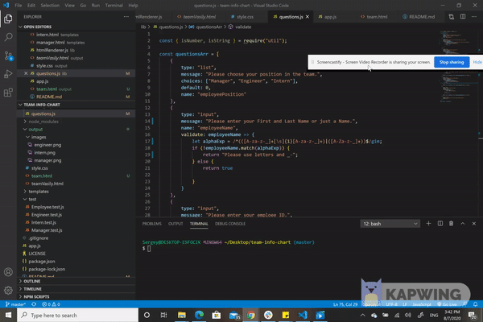
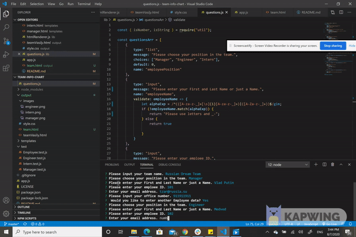
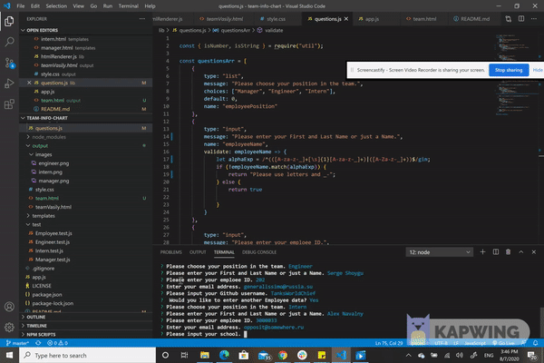
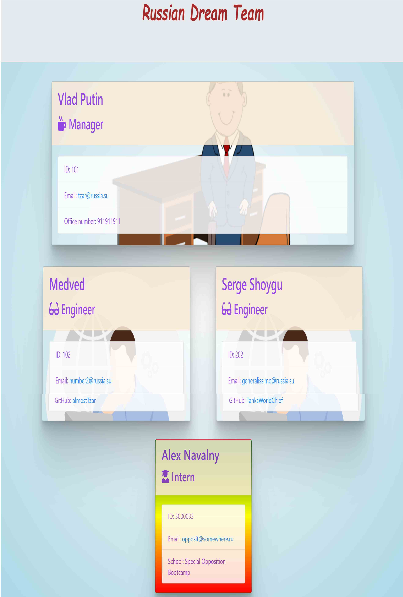

# Team Info Chart Project 
## Description 

We need build a software engineering team generator command line application. The application will prompt the user for information about the team manager and then information
 about the team members. The user can input any number of team members, and they may be a mix of engineers and interns. This assignment must also pass all unit TDD tests. When the user has completed building the team, the application will create an HTML file that displays a nicely formatted team roster based on the 
information provided by the user.

```
As a manager
I want to generate a webpage that displays my team's basic info
so that I have quick access to emails and GitHub profiles
```


## Table of Contents
* [Installation](#installation)
* [Usage](#usage)
* [Tests](#tests)
* [License](#license)
* [Questions](#questions)
* [Review](#review)
## Installation 

Clone my repository. Install dependencies. The dependencies are, jest for running the provided tests, and inquirer for collecting input from the user.

```
git clone git@github.com:sbolotnikov/team-info-chart.git
yarn install
```

## Usage 

To start 

```
node index.js
```
Look at video for further instructions:
[YouTube](https://youtu.be/mlQAWMMPP2w )

The project prompts the user to build an engineering team. An engineering
team consists of a manager, and any number of engineers and interns.

### Roster output

The project must generate a `team.html` page in the `output` directory, that displays a nicely formatted team roster. Each team member should display the following in no particular order:

  * Name

  * Role

  * ID

  * Role-specific property (School, link to GitHub profile, or office number)

 

 

 

 

there is a Youtube video in the same folder with images

## Contributing 
 None 
## License 
 Licensed under MIT License. 
## Tests 
Unit tests helping to build necessary classes. You can run them by:
```
jest --verbose
```
All tests are in `test` folder 
## Questions 
 You can see more of my Projects on my [GitHub profile](https://github.com/sbolotnikov) 

 Contact [sbolotnikov](mailto:sbolotnikov@gmail.com) 
## Review 
  * Here is this repo link: https://github.com/sbolotnikov/team-info-chart
 
  * Link: application is not deployed